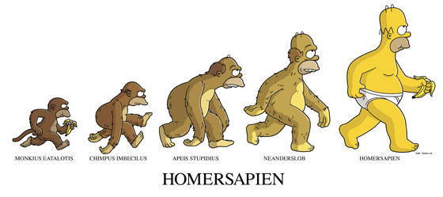
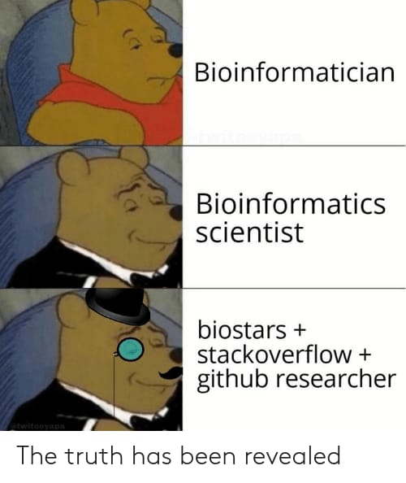

```{r setup, include = FALSE}
# Setup chunk
# Paquetes a usar
#options(htmltools.dir.version = FALSE) cambia la forma de incluir código, los colores

library(knitr)
library(tidyverse)
library(xaringanExtra)
library(icons) # # install.packages("remotes"); remotes::install_github("mitchelloharawild/icons")
library(fontawesome)
library(emo) # install.packages("devtools"); devtools::install_github("hadley/emo")

# set default options
opts_chunk$set(collapse = TRUE,
               dpi = 300,
               warning = FALSE,
               error = FALSE,
               comment = "#")

top_icon = function(x) {
  icons::icon_style(
    icons::fontawesome(x),
    position = "fixed", top = 10, right = 10
  )
}

knit_engines$set("yaml", "markdown")

# Con la tecla "O" permite ver todas las diapositivas
xaringanExtra::use_tile_view()
# Agrega el boton de copiar los códigos de los chunks
xaringanExtra::use_clipboard()

# Crea paneles impresionantes 
xaringanExtra::use_panelset()

# Para compartir e incrustar en otro sitio web
xaringanExtra::use_share_again()
xaringanExtra::style_share_again(
  share_buttons = c("twitter", "linkedin")
)

# Funcionalidades de los chunks, pone un triangulito junto a la línea que se señala
xaringanExtra::use_extra_styles(
  hover_code_line = TRUE,         #<<
  mute_unhighlighted_code = TRUE  #<<
)

# Agregar web cam
xaringanExtra::use_webcam()
```

```{r xaringan-editable, echo=FALSE}
# Para tener opciones para hacer editable algun chunk
xaringanExtra::use_editable(expires = 1)
# Para hacer que aparezca el lápiz y goma
xaringanExtra::use_scribble()
```

```{r xaringan-themer Eve, include=FALSE, warning=FALSE}
# Establecer colores para el tema
library(xaringanthemer)
#style_xaringan(
style_duo_accent(
  background_color = "#FFFFFF", # color del fondo
  link_color = "#562457", # color de los links
  text_bold_color = "#0072CE",
  primary_color = "#01002B", # Color 1
  secondary_color = "#CB6CE6", # Color 2
  inverse_background_color = "#00B7FF", # Color de fondo secundario 
  
  # Tipos de letra
  header_font_google = google_font("Barlow Condensed", "600"), #titulo
  text_font_google   = google_font("Work Sans", "300", "300i"), #texto
  code_font_google   = google_font("IBM Plex Mono") #codigo
  #text_font_size = "1.5rem" # Tamano de letra
)

# https://www.rdocumentation.org/packages/xaringanthemer/versions/0.3.4/topics/style_duo_accent
```

class: title-slide, middle, center
background-image: url(figures/Clases_Rladies_Slide1.png) 
background-position: 90% 75%, 75% 75%, center
background-size: 1210px,210px, cover


.center-column[
# `r rmarkdown::metadata$title`
### `r rmarkdown::metadata$subtitle`

####`r rmarkdown::metadata$author` 
#### `r rmarkdown::metadata$date`
]

.left[.footnote[R-Ladies Theme[R-Ladies Theme](https://www.apreshill.com/project/rladies-xaringan/)]]

---
background-image: url(figures/Rladies_logo.png) 
background-position: 10% 10%
background-size: 10%
class: middle, center


# Sobre mi
----

.left-col[

### `r fontawesome::fa("dna", fill = "#181818")` Dra. Evelia Lorena Coss-Navarrete

Investigadora Posdoctoral en el Laboratorio Internacional de Investigación sobre el Genoma Humano [(LIIGH), UNAM](https://twitter.com/LIIGH_UNAM), campus Juriquilla


[`r fontawesome::fa("link")` Dra Alejandra Medina-Rivera](https://liigh.unam.mx/profile/dra-alejandra-medina-rivera/)

[`r fontawesome::fa("github")` EveliaCoss.github.io](https://eveliacoss.github.io/)

]


.center-col[


### `r fontawesome::fa("star", fill = "#181818")` Miembro

- [LupusRGMX](https://twitter.com/LupusRgmx)

- [Proyecto JAGUAR](https://twitter.com/PJaguarLATAM)

- [Rladies Morelia](https://www.facebook.com/profile.php?id=100093337606435)

- [CDSB - Mexico](https://twitter.com/CDSBMexico)

- [RIABIO](https://twitter.com/RiaBioNet)
]


.right-col[

### `r fontawesome::fa("circle-nodes", fill = "#181818")` Formación académica

- Doctorado en Biotecnología de Plantas, [Cinvestav, Langebio](https://twitter.com/uga_langebio),  [`r fontawesome::fa("link")` Dra Selene Fernandez-Valverde](https://twitter.com/SelFdz)

- Maestría en Biotecnología de Plantas, [Cinvestav, Unidad Irapuato](https://twitter.com/CinvestavIra)

- Ing. en Biotecnología, [UPSIN](https://www.facebook.com/UPSINSINALOA)

]

---
## Bioinformática se conforma de la computación, biológica, matemáticas y estadística


La bioinformática, en relación con la **genética y la genómica**, es una **subdisciplina científica** que implica el uso de **ciencias informáticas** para *recopilar, almacenar, analizar y diseminar datos biológicos*, como secuencias de ADN y aminoácidos o anotaciones sobre esas secuencias [NIH, 2023](https://www.genome.gov/es/genetics-glossary/Bioinformatica). 

Uno de sus objetivos es: **Aumentar el entendimiento de la salud y la enfermedad, en ciertos casos, se usan para proveer mejor atención médica** [NIH, 2023](https://www.genome.gov/es/genetics-glossary/Bioinformatica).

.left[.footnote[.black[
NIH: National Human Genome Research Institute
]]]

---

## La bioinformática dentro de la genómica

1) **Calidad de los datos**. Paso **FUNDAMENTAL**. Incluye la manipulación y limpieza de los datos. (Temas vistos con Sofia Zorrilla y Maria Jose Palma Martinez; Mayra Fragoso)

2) **Análisis estadístico**

> EJEMPLO: Significancia estadística, significancia biológica, modelos estadísticos acorde al problema.

3) **Generar interpretaciones de los experimentos**. Conocer el método empleado y los archivos de salida.

> EJEMPLOS: Con los datos de RNA-Seq estaremos analizando expresión de los genes. Con datos de GWAS estaremos buscando variantes genéticas.

4) **Bioinformática predictiva**

> EJEMPLO: Predicciones de funciones, elementos genómicos, redes de co-expresión, etc.

---

## Objetivo de este mini curso: 📌
----

### Hacia una biología **computacional más reproducible, transparente y colaborativa** 💜

> “Los hechos individuales no reproducibles no tienen ninguna importancia para la ciencia”
>
> Karl Popper

.left[.footnote[.black[
Más información [aquí](https://ellipse.prbb.org/es/hacia-una-biologia-computacional-mas-reproducible-transparente-y-colaborativa/).
]]]

---
class: inverse, center, middle

`r fontawesome::fa("laptop-file", height = "3em")`
# Escribiendo un buen software

---

# Un algoritmo nos permite resolver un problema

Un algoritmo es un método para resolver un problema mediante una serie de pasos **definidos, precisos** y **finitos**.

- **Definido**: si se sigue dos veces, se obtiene el mismo resultado. Es reproducible.

- **Preciso**: implica el orden de realización de cada uno de los pasos.

- **Finito**: Tiene un numero determinado de pasos, implica que tiene un fin.

> Un algoritmo podemos definirlo como un **programa o software**.

---

# Para escribir un buen software necesitas:

> Escribir **código mantenible (maintainable code), usar control de versiones (version control) y rastreadores de problemas (issue trackers), revisiones de código (code reviews), pruebas unitarias (unit testing) y automatización de tareas (task automation)**.
>
> Wilson, et al. 2014. PLOS  Biology

Con el fin de *previnir retracciones*.

.left[.footnote[.black[
[Best Practices for Scientific Computing - The Carpentries](https://doi.org/10.1371/journal.pbio.1001745)
]]]

---

## Código reproducible

.pull-left[
### Contenedores:

- [Docker](https://docs.docker.com/) 
- [Singularity](https://docs.sylabs.io/guides/3.5/user-guide/introduction.html)
- [Apptainer](https://apptainer.org/)

Se puede almacenar todo el workflow, archivos, generando codigo reproducible y cooperativo.

> Minicurso del uso de [Docker](https://www.melbournebioinformatics.org.au/tutorials/tutorials/docker/docker/).

]

.pull-right[

### Crear pipelines completos

- [Nextflow](https://training.nextflow.io/es/)
- [Snakemake](https://snakemake.readthedocs.io/en/stable/tutorial/tutorial.html)
]

---

# Pasos para escribir un buen software

.pull-left[
1) Análisis del problema / Definir el problema

2) Diseño del algoritmo / Diseño del programa

3) Codificación / Escribir el código

4) Compilación y ejecución del programa

5) Verificación / Realizar pruebas

6) Depuración / Detectar los errores y corregirlos

> Programacion defensiva

7) Documentación

]

.center[.pull-right[
]
]

---

## Paso 7: Documentación

.content-box-gray[
- *Autor (author)*: Su nombre

- *Dia (date)*: Fecha de creación

- *Paquetes (packages)*

- *Directorio de trabajo (Working directory)*: En que carpeta se encuentra tu datos y programa.

- *Información descriptiva del programa (Description)*: ¿Para qué sirve el programa? Ej: El siguiente programa realiza la suma de dos numeros enteros a partir de la entrada del usuario y posteriormente la imprime en pantalla.

- *Usage* ¿Cómo se utiliza?

- *Argumentos (Arguments)*

  - *Información de entrada (Data Inputs)*: Ej: Solo numeros enteros (sin decimales).

  - *Información de salida (Outpus)*: Graficas, figuras, tablas, etc.

]
---

.center[


]

---

## Puntos claves ⭐

1) Escriba **programas para personas, no para computadoras** (Documenta qué hace y por qué). - Se coherente en la nomenclatura, indentación y otros aspectos del estilo. 

2) Divide los programas en **funciones cortas de un solo propósito*. 💻 📚

3) **No repitas tu código**. Crea pasos reproducibles o que se repitan por si solas. ➰

4) Planifique los errores (**Programacion defensiva**) 🚩

5) **Optimice el software sólo después de que funcione correctamente**. - Si funciona no lo modifiques, simplificalo. 

6) Colaborar - Busque siempre bibliotecas de software bien mantenidas que hagan lo que necesita. 👥


> Ninguna de estas prácticas garantizará un desarrollo de software eficiente y libre de errores, pero utilizadas en conjunto **reducirán el número de errores en el software científico**, facilitarán su **reutilización** y ahorrarán a los autores del software **tiempo y esfuerzo** que pueden utilizar para centrarse. sobre las cuestiones científicas subyacentes.
> 
> Wilson, et al. 2014. PLOS  Biology

.left[.footnote[.black[
Más información [Escribiendo buen software](https://swcarpentry.github.io/r-novice-gapminder-es/16-wrap-up.html) y [Best Practices for Scientific Computing - The Carpentries](https://doi.org/10.1371/journal.pbio.1001745)
]]]

---

## Documentación de funciones

```
Synthesize image files for testing circularity estimation algorithm.

Usage: make_images.py -f fuzzing -n flaws -o output -s seed -v -w size

where:
-f fuzzing = fuzzing range of blobs (typically 0.0-0.2)
-n flaws   = p(success) for geometric distribution of # flaws/sample (e.g. 0.5-0.8)
-o output  = name of output file
-s seed    = random number generator seed (large integer)
-v         = verbose
-w size    = image width/height in pixels (typically 480-800)
-h = show help message
```

> Cuando ya vayamos a crear un paquete podemos usar [`roxygen2`](https://github.com/r-lib/roxygen2) para la documentacion de las funciones.

Yo uso el ejemplo de la funcion [`suma()`](https://www.rdocumentation.org/packages/base/versions/3.6.2/topics/sum).

.left[.footnote[.black[
[Good Enough Practices for Scientific Computing](https://swcarpentry.github.io/good-enough-practices-in-scientific-computing/)
]]]

---

# Ejemplo de como documento

Aqui les dejo el script que les doy a mis alumnos [VisualizacionDatos.R](https://github.com/EveliaCoss/RNAseq_classFEB2024/blob/main/Practica_Dia3/scripts/VisualizacionDatos.R) del curso de [Análisis de datos de RNA-Seq ](https://github.com/EveliaCoss/RNAseq_classFEB2024).

---

## Ejemplo:

El software detecta la informacion que esta posterior al `#'`.

```{r, eval=FALSE}
# install.packages("docstring")
library(docstring)
library(roxygen2)

multiply <- function(x,y){
#' @title Multiply two numbers
#' @description This function takes two
#' input numbers and multiplies
#' them. It returns the multiplied result.
#' @param x The first value
#' @param y The second value
#' @return The two arguments multiplied.

  return(x*y)
}

?multiply
```

.left[.footnote[.black[
Ejercicio tomado de [aqui](https://utrechtuniversity.github.io/workshop-computational-reproducibility/chapters/comments-and-docstrings.html). Documentacion [docstring](https://cran.r-project.org/web/packages/docstring/vignettes/docstring_intro.html).
]]]

---
## NOTAS

> Usa el mismo estilo que en el paquete [`roxygen2`](https://github.com/r-lib/roxygen2). Generan un archivo RD que se lee en R en la seccion Help.

> NOTA: para proyectos podemos usar el template [simple-r-project](https://github.com/UtrechtUniversity/simple-r-project).

> NOTA: Los parametros de la documentacion de [docstring](https://cran.r-project.org/web/packages/docstring/vignettes/docstring_intro.html)

---
class: inverse, center, middle

`r fontawesome::fa("laptop-file", height = "3em")`
# Ejercicio: Crear un paquete y su viñeta (vignette)

---

## Características de una vignette

- Debe mostrar un **flujo de análisis** explotando el **potencial** de tu paquete.
- Implementa tantas **funciones de tu paquete como sea posible**, pero no es necesario que incluya todas.
- Los datos a usar deben ser pequeños o fáciles de acceder - *test*
- Puedes crear múltiples viñetas para mostrar diferentes casos de análisis y cubrir una mayor cantidad de funciones.

Ejemplo:

```{r, eval=FALSE}
browseVignettes(package = "ggplot2")
```

.left[.footnote[.black[
[Curso de Joselyn Cristina Chávez Fuentes](https://comunidadbioinfo.github.io/cdsb2023/creaci%C3%B3n-de-vi%C3%B1etas.html)
]]]

---

# Paquetes necesarios

```{r, eval=FALSE}
# install.packages("devtools")
library(usethis) # usethis::create_package()
library(dplyr)
library(ggplot2)
```

---

# Pasos para crear un paquete

Muy general, es un paquete para nosotros, por lo que solo funciona en nuestra compu.

## Paso 1:   


Me ayudo mucho este [Video](https://www.youtube.com/watch?v=7ZgZ6qUKZvE&ab_channel=DaniMedi).


Esta función tendrá tres efectos:

- Generar el directorio vignettes en caso que no exista.
- Agregar dependencias en el archivo DESCRIPTION (por ejemplo, knitr necesario para construir viñetas dentro del paquete).
- Abrir un templado en formato .Rmd para comenzar a escribir la viñeta, que se va a guardar en vignettes/mi_vignette.Rmd

> NOTA: Este codigo tiene conflictos cuando la carpeta tiene en su nombre espacios.


.left[.footnote[.black[
[Documentacion](https://lcolladotor.github.io/biocthis/articles/biocthis.html#use_bioc_vignette); [Curso de Joselyn Cristina Chávez Fuentes](https://comunidadbioinfo.github.io/cdsb2023/creaci%C3%B3n-de-vi%C3%B1etas.html)
]]]


---

# Veamos un ejemplo

Busca la viñeta del paquete regutools en la página de Bioconductor https://bioconductor.org/packages/release/bioc/html/regutools.html

.left[.footnote[.black[
[Curso de Joselyn Cristina Chávez Fuentes](https://comunidadbioinfo.github.io/cdsb2023/creaci%C3%B3n-de-vi%C3%B1etas.html)
]]]

---

#### Otros materiales interesantes

.pull-left[
### Diseño de pruebas

- [testthat](https://testthat.r-lib.org/)

- Curso impartido por [Mirna Vázquez Rosas-Landa](https://comunidadbioinfo.github.io/cdsb2023/dise%C3%B1o-de-pruebas.html)

### Control de versiones con GitHub y Rstudio

- Curso impartido por [Alejandra Medina](https://comunidadbioinfo.github.io/cdsb2023/control-de-versiones-con-github-y-rstudio.html)
- [video](https://www.youtube.com/watch?v=iv08zmyzKVE&list=PLwa0ZAE6DJg6MjRAz3uSl0BTXEz9E3uF4&index=3&ab_channel=CommunityofBioinformaticsSoftwareDevelopers)
]

.pull-right[

### Creando paquetes en R

- [Leonardo Collado](https://github.com/lcolladotor)
- paquete [biocthis](https://github.com/lcolladotor/biocthis)
- [Video de Joselyn Chavez](https://www.youtube.com/watch?v=DCni-LcxLtg&list=PLwa0ZAE6DJg6MjRAz3uSl0BTXEz9E3uF4&index=12&ab_channel=CommunityofBioinformaticsSoftwareDevelopers)
- [Video de Leonardo Collado](https://www.youtube.com/watch?v=1bRR-P_y59A&ab_channel=ConectaR)
- Github de [CDSB 2023](https://github.com/ComunidadBioInfo/cdsb2023)

.center[
]

]

---

# Licencias

Que pueden hacer o que no pueden hacer las personas con tu codigo.

- [Creative Commons Attribution 4.0 International License](http://creativecommons.org/licenses/by/4.0/)
- [MIT Licence](https://github.com/NBISweden/workshop-reproducible-research/blob/main/LICENCE.txt)
- [GNU General Public License v3.0](https://github.com/INMEGEN/taller.supercomputo/blob/master/LICENSE)

---

background-image: url(figures/TheCarpentries-logo.png) 
background-position: 10% 10%
background-size: 10%
class: middle, center


# Instructoras certificadas **The Carpentries**
----

.left-col[


### `r fontawesome::fa("star", fill = "#181818")` Divisiones:

- [Software Carpentry](https://software-carpentry.org/lessons/)

- [Data Carpentry](http://www.datacarpentry.org/lessons/)

- [Library Carpentry](https://librarycarpentry.org/lessons/)
]

.center[
Miembros actuales de Rladies: Nelly Selem, Haydee Peruyeri, Driselda Sanchez, Mayra Fragoso, Evelia Coss, Quetzally Medina.
]

---

## Siempre toma lo mejor de los mejores y aprende de sus códigos

.center[


]

---

class: center, middle

`r fontawesome::fa("code", height = "3em")`
# Fin

Gracias por tu atención, respira y coméntame tus dudas. 

---

# Referencias 

.pull-left[
- [Accessibility & Reproducibility](https://utrechtuniversity.github.io/workshop-computational-reproducibility/chapters/schedule.html)
- [Cookiecutter](https://www.cookiecutter.io/)
- [cookiecutter-data-science - Python](https://github.com/drivendataorg/cookiecutter-data-science)
- [assertr](https://cran.r-project.org/web/packages/assertr/vignettes/assertr.html)
- [simple-r-project](https://github.com/UtrechtUniversity/simple-r-project)
- [Video - Regulacion de bioinformatica](https://www.facebook.com/watch/?v=222045292638259)
- [ISO 9001](https://alliancetrustc.com/iso-9001/)
- [Articulo sobre las leyes de regulacion de bioinformatica](http://scielo.sld.cu/scielo.php?script=sci_arttext&pid=S0864-21412022000300020)
- [Github - Tools for Reproducible Research](https://github.com/NBISweden/workshop-reproducible-research)
- [Articulo - Publish your computer code: it is good enough](https://www.nature.com/articles/467753a)
]

.pull-right[
- [Articulo - Ten Simple Rules for Reproducible Computational Research](https://journals.plos.org/ploscompbiol/article?id=10.1371/journal.pcbi.1003285)
- [Writing Reproducible Manuscripts in R & Python](https://utrechtuniversity.github.io/workshop-reproducible-manuscripts/acknowledgements.html)
- [Best practices in bioinformatics research: open source software and reproducibility](https://github.com/lgatto/open-rr-bioinfo-best-practice)
- [Introducción a la bioinformática e investigación reproducible para análisis genómicos](https://github.com/u-genoma/BioinfinvRepro)
]
